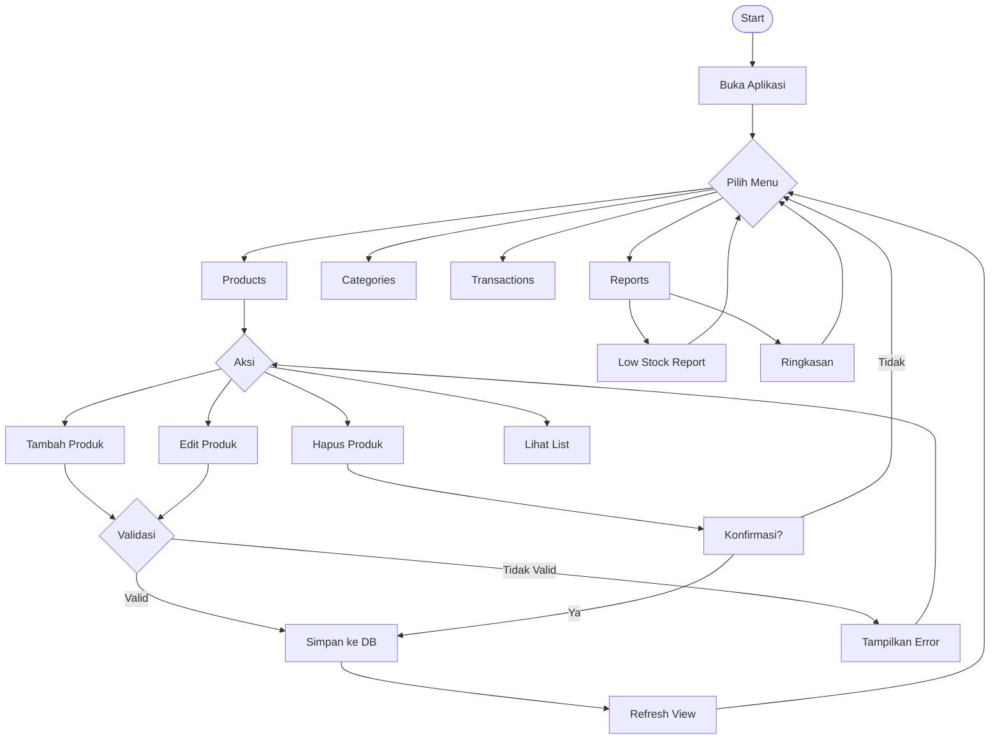
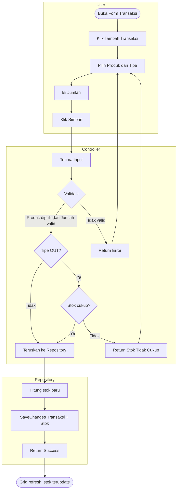

# Product Requirements Document (PRD)
## Inventory Management System v1.0

---

| Field | Detail |
|---|---|
| **Dokumen** | Product Requirements Document |
| **Versi** | 1.0.0 |
| **Status** | Released |
| **Tanggal** | April 2026 |
| **Platform** | Windows Desktop |
| **Teknologi** | C# · .NET 9 · Windows Forms · EF Core 9 · SQL Server 2022 |

---

## 1. Latar Belakang

Banyak usaha kecil dan menengah masih mengelola inventaris secara manual menggunakan
spreadsheet atau catatan fisik. Cara ini rentan terhadap kesalahan pencatatan, kehilangan
data, dan kesulitan memantau kondisi stok secara real-time.

**Inventory Management System (IMS)** hadir sebagai solusi aplikasi desktop sederhana
yang memungkinkan pengguna mengelola data produk, kategori, dan pergerakan stok secara
terpusat, akurat, dan mudah digunakan tanpa memerlukan koneksi internet.

---

## 2. Tujuan Produk

- Menyediakan antarmuka desktop yang mudah digunakan untuk manajemen inventaris
- Mencatat setiap pergerakan stok (masuk, keluar, penyesuaian) secara akurat
- Memberikan peringatan dini ketika stok produk mendekati batas minimum
- Menyajikan laporan ringkas kondisi inventaris kepada pengguna
- Membangun fondasi arsitektur yang dapat dikembangkan ke API dan multi-user

---

## 3. Pengguna Target

| Segmen | Deskripsi |
|---|---|
| Pemilik usaha kecil | Mengelola inventaris toko atau gudang secara mandiri |
| Staff administrasi | Mencatat transaksi stok harian dan memantau ketersediaan barang |
| Teknisi IT | Melakukan instalasi dan konfigurasi di komputer client |


---

## 4. Ruang Lingkup

### 4.1 Dalam Lingkup (In Scope) — v1.0

- Manajemen data Kategori produk (CRUD)
- Manajemen data Produk dengan atribut lengkap (CRUD + search + low stock alert)
- Pencatatan Transaksi stok: masuk (IN), keluar (OUT), penyesuaian (ADJUSTMENT)
- Update stok otomatis setiap kali transaksi disimpan
- Laporan Low Stock: daftar produk stok di bawah batas minimum
- Laporan Ringkasan: total produk, kategori, dan transaksi
- Validasi data bisnis di Controller layer
- Distribusi sebagai file EXE self-contained (tanpa perlu install .NET)
- Database SQL Server lokal dengan migrasi otomatis

### 4.2 Di Luar Lingkup (Out of Scope) — v1.0

- Autentikasi pengguna dan manajemen role
- Akses multi-pengguna secara bersamaan
- Integrasi REST API eksternal
- Ekspor laporan ke Excel atau PDF
- Notifikasi email atau push notification
- Aplikasi berbasis web atau mobile

---

## 5. Kebutuhan Fungsional

### F-01 · Manajemen Kategori

| ID | Kebutuhan | Prioritas |
|---|---|---|
| F-01-1 | Tambah kategori baru dengan Nama dan Deskripsi | Wajib |
| F-01-2 | Edit nama dan deskripsi kategori yang sudah ada | Wajib |
| F-01-3 | Hapus kategori yang tidak memiliki produk | Wajib |
| F-01-4 | Sistem menolak penghapusan kategori yang masih memiliki produk | Wajib |
| F-01-5 | Nama kategori harus unik di seluruh sistem | Wajib |
| F-01-6 | Pencarian kategori berdasarkan nama secara real-time | Penting |

### F-02 · Manajemen Produk

| ID | Kebutuhan | Prioritas |
|---|---|---|
| F-02-1 | Tambah produk baru dengan: Nama, SKU, Kategori, Harga, Stok, Min Stok, Deskripsi | Wajib |
| F-02-2 | Edit data produk yang sudah ada | Wajib |
| F-02-3 | Hapus produk | Wajib |
| F-02-4 | SKU harus unik di seluruh sistem | Wajib |
| F-02-5 | Pencarian produk berdasarkan Nama atau SKU secara real-time | Wajib |
| F-02-6 | Highlight visual (warna merah) untuk produk dengan stok di bawah Min Stok | Wajib |
| F-02-7 | Kategori produk dapat dipilih dari daftar kategori yang sudah ada | Wajib |


### F-03 · Manajemen Transaksi Stok

| ID | Kebutuhan | Prioritas |
|---|---|---|
| F-03-1 | Tambah transaksi baru dengan: Produk, Tipe, Jumlah, Harga Satuan, Catatan | Wajib |
| F-03-2 | Tipe transaksi: IN (masuk), OUT (keluar), ADJUSTMENT (penyesuaian langsung) | Wajib |
| F-03-3 | Stok produk terupdate otomatis setelah transaksi tersimpan | Wajib |
| F-03-4 | Transaksi OUT ditolak jika jumlah melebihi stok yang tersedia | Wajib |
| F-03-5 | Transaksi bersifat permanen, tidak bisa diedit atau dihapus | Wajib |
| F-03-6 | Tampilan grid dengan warna berbeda per tipe: hijau (IN), merah (OUT), kuning (ADJ) | Penting |
| F-03-7 | Filter tampilan transaksi berdasarkan produk tertentu | Penting |

### F-04 · Laporan

| ID | Kebutuhan | Prioritas |
|---|---|---|
| F-04-1 | Laporan Low Stock: daftar produk dengan stok di bawah atau sama dengan Min Stok | Wajib |
| F-04-2 | Kolom Kekurangan: menampilkan selisih antara Min Stok dan Stok saat ini | Penting |
| F-04-3 | Laporan Ringkasan: total produk, kategori, dan transaksi | Penting |
| F-04-4 | Indikator visual (merah/hijau) pada jumlah produk yang perlu restock | Penting |

---

## 6. Kebutuhan Non-Fungsional

| ID | Kebutuhan | Detail |
|---|---|---|
| NF-01 | Platform | Windows 10 / 11 (64-bit) |
| NF-02 | Database | SQL Server 2022 (termasuk Express edition) |
| NF-03 | Distribusi | Self-contained EXE, tidak perlu install .NET Runtime |
| NF-04 | Performa | Form dan DataGridView harus merespons dalam 2 detik untuk data hingga 1.000 produk |
| NF-05 | Validasi | Semua input divalidasi sebelum dikirim ke database |
| NF-06 | Integritas data | Stok tidak boleh bernilai negatif setelah transaksi apapun |
| NF-07 | Arsitektur | MVC + Repository Pattern dengan Interface untuk mendukung pengembangan masa depan |
| NF-08 | Konfigurasi | Connection string disimpan di appsettings.json, terpisah dari kode |

---

## 7. Arsitektur Sistem

```
Forms (View)
    │
    ▼
Controllers (Logika Bisnis + Validasi)
    │
    ▼
Repositories / Interfaces (Abstraksi Akses Data)
    │
    ▼
DbContext — EF Core (ORM)
    │
    ▼
SQL Server 2022 (Database)
```

### Struktur Folder Project

```
InventoryApp/
├── Controllers/     Logika bisnis dan validasi input
├── Data/            DbContext dan konfigurasi EF Core
├── Forms/           Semua Windows Forms (UI layer)
├── Migrations/      Migration database (auto-generated EF Core)
├── Models/          Domain models: Product, Category, Transaction
└── Repositories/    Akses database lewat interface
    └── Interfaces/  Kontrak repository
```


---

## 8. Model Data

### Entity: Category

| Field | Tipe | Constraint | Keterangan |
|---|---|---|---|
| Id | int | PK, Auto-increment | Primary key |
| Name | nvarchar(100) | NOT NULL, UNIQUE | Nama kategori |
| Description | nvarchar(500) | NULL | Deskripsi opsional |

### Entity: Product

| Field | Tipe | Constraint | Keterangan |
|---|---|---|---|
| Id | int | PK, Auto-increment | Primary key |
| Name | nvarchar(150) | NOT NULL | Nama produk |
| SKU | nvarchar(50) | NOT NULL, UNIQUE | Kode produk unik |
| Description | nvarchar(500) | NULL | Deskripsi opsional |
| Price | decimal(18,2) | NOT NULL | Harga produk |
| Stock | int | NOT NULL, >= 0 | Jumlah stok saat ini |
| MinStock | int | NOT NULL | Batas minimum stok |
| CategoryId | int | FK → Categories.Id | Kategori produk |
| CreatedAt | datetime2 | NOT NULL | Waktu dibuat |
| UpdatedAt | datetime2 | NOT NULL | Waktu terakhir diubah |

### Entity: Transaction

| Field | Tipe | Constraint | Keterangan |
|---|---|---|---|
| Id | int | PK, Auto-increment | Primary key |
| ProductId | int | FK → Products.Id | Produk yang bertransaksi |
| Type | int | NOT NULL | 1=IN, 2=OUT, 3=ADJUSTMENT |
| Quantity | int | NOT NULL, > 0 | Jumlah barang |
| UnitPrice | decimal(18,2) | NOT NULL | Harga satuan saat transaksi |
| Notes | nvarchar(500) | NULL | Catatan opsional |
| TransactionDate | datetime2 | NOT NULL | Waktu transaksi |

---

## 9. Aturan Bisnis

| ID | Aturan |
|---|---|
| BR-01 | SKU produk harus unik di seluruh tabel Products |
| BR-02 | Nama kategori harus unik di seluruh tabel Categories |
| BR-03 | Transaksi OUT tidak dapat melebihi jumlah stok yang tersedia |
| BR-04 | Stok produk tidak boleh bernilai negatif setelah transaksi apapun |
| BR-05 | Transaksi ADJUSTMENT mengganti nilai stok secara langsung (bukan tambah/kurang) |
| BR-06 | Kategori yang masih memiliki produk tidak dapat dihapus |
| BR-07 | Transaksi yang sudah tersimpan tidak dapat diedit atau dihapus |
| BR-08 | Update stok dan penyimpanan transaksi dilakukan dalam satu operasi atomik |

---

## 10. Antarmuka Pengguna

### Daftar Form

| Form | Fungsi |
|---|---|
| MainForm | Jendela utama, berisi menu navigasi |
| ProductForm | Daftar produk dengan DataGridView, search, dan toolbar CRUD |
| ProductDetailForm | Dialog tambah / edit satu produk |
| CategoryForm | Daftar kategori dengan search dan toolbar CRUD |
| CategoryDetailForm | Dialog tambah / edit satu kategori |
| TransactionForm | Daftar transaksi dengan filter by produk |
| TransactionDetailForm | Dialog tambah transaksi baru |
| ReportForm | Laporan low stock (tab 1) dan ringkasan (tab 2) |


---

## 11. Kriteria Penerimaan (Acceptance Criteria)

### AC-01 · Produk
- [ ] Produk baru dapat ditambahkan dan langsung muncul di DataGridView
- [ ] Produk dapat diedit dan perubahan tersimpan ke database
- [ ] Produk dapat dihapus dengan konfirmasi
- [ ] Pencarian real-time memfilter grid saat pengguna mengetik
- [ ] Baris produk dengan stok <= MinStock tampil berwarna merah
- [ ] SKU duplikat ditolak dengan pesan error yang jelas

### AC-02 · Transaksi
- [ ] Transaksi IN menambah stok produk sejumlah Quantity
- [ ] Transaksi OUT mengurangi stok produk sejumlah Quantity
- [ ] Transaksi ADJUSTMENT mengganti stok langsung ke nilai Quantity
- [ ] Transaksi OUT dengan jumlah melebihi stok ditolak dengan pesan error
- [ ] Warna baris grid: hijau (IN), merah (OUT), kuning (ADJUSTMENT)

### AC-03 · Laporan
- [ ] Tab Low Stock menampilkan semua produk dengan stok <= MinStock
- [ ] Kolom Kekurangan menampilkan nilai (MinStock - Stock) dengan benar
- [ ] Tab Ringkasan menampilkan angka total yang akurat
- [ ] Label "Perlu Restock" berwarna merah jika jumlah > 0

---

## 12. Dependensi Teknis

| Package | Versi | Fungsi |
|---|---|---|
| Microsoft.EntityFrameworkCore | 9.0.x | ORM untuk akses database |
| Microsoft.EntityFrameworkCore.SqlServer | 9.0.x | Provider SQL Server |
| Microsoft.EntityFrameworkCore.Tools | 9.0.x | CLI untuk migration |
| Microsoft.Extensions.Configuration.Json | 9.0.x | Membaca appsettings.json |

---

## 13. Deployment

| Item | Detail |
|---|---|
| Target OS | Windows 10 / 11 (64-bit) |
| Runtime | Self-contained (tidak perlu install .NET di komputer target) |
| Database server | SQL Server 2022 Express (gratis, diinstall di komputer client) |
| Konfigurasi | appsettings.json di folder yang sama dengan EXE |
| Setup database | Script SQL manual atau migrasi otomatis via database.Migrate() |
| Ukuran paket | ~150-200 MB (termasuk .NET runtime) |

---

## 14. Roadmap Pengembangan Masa Depan

### v2.0 — Autentikasi & Role

- Login dengan username dan password
- Role: Super Admin (akses penuh) dan Admin (akses terbatas)
- Audit log: siapa yang melakukan transaksi dan kapan

### v3.0 — REST API

- Migrasi layer Controller dan Repository ke ASP.NET Core Web API
- Database: Supabase PostgreSQL (cloud)
- Windows Forms terhubung ke API via HTTP client
- Fondasi untuk aplikasi web atau mobile di masa depan

---

## 15. Riwayat Dokumen

| Versi | Tanggal | Perubahan |
|---|---|---|
| 1.0.0 | April 2026 | Dokumen awal — rilis v1.0 |

---

*Dokumen ini dibuat sebagai bagian dari proses pengembangan Inventory Management System v1.0.*
*Arsitektur MVC + Repository Pattern yang digunakan memastikan kemudahan pengembangan di versi berikutnya.*

---

## 16. Diagram Alur Bisnis

Semua diagram menggunakan sintaks **Mermaid JS**.
Render di VS Code, GitHub, atau https://mermaid.live

### 16.1 Flowchart — Alur Utama Aplikasi



### 16.2 Activity Diagram — Alur Pencatatan Transaksi



