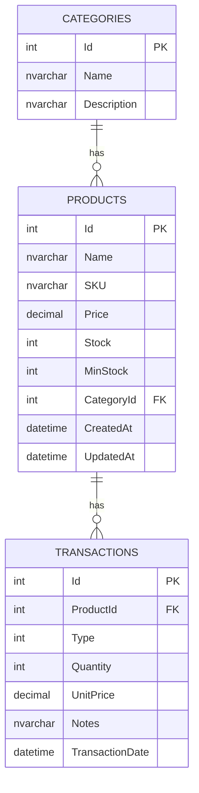
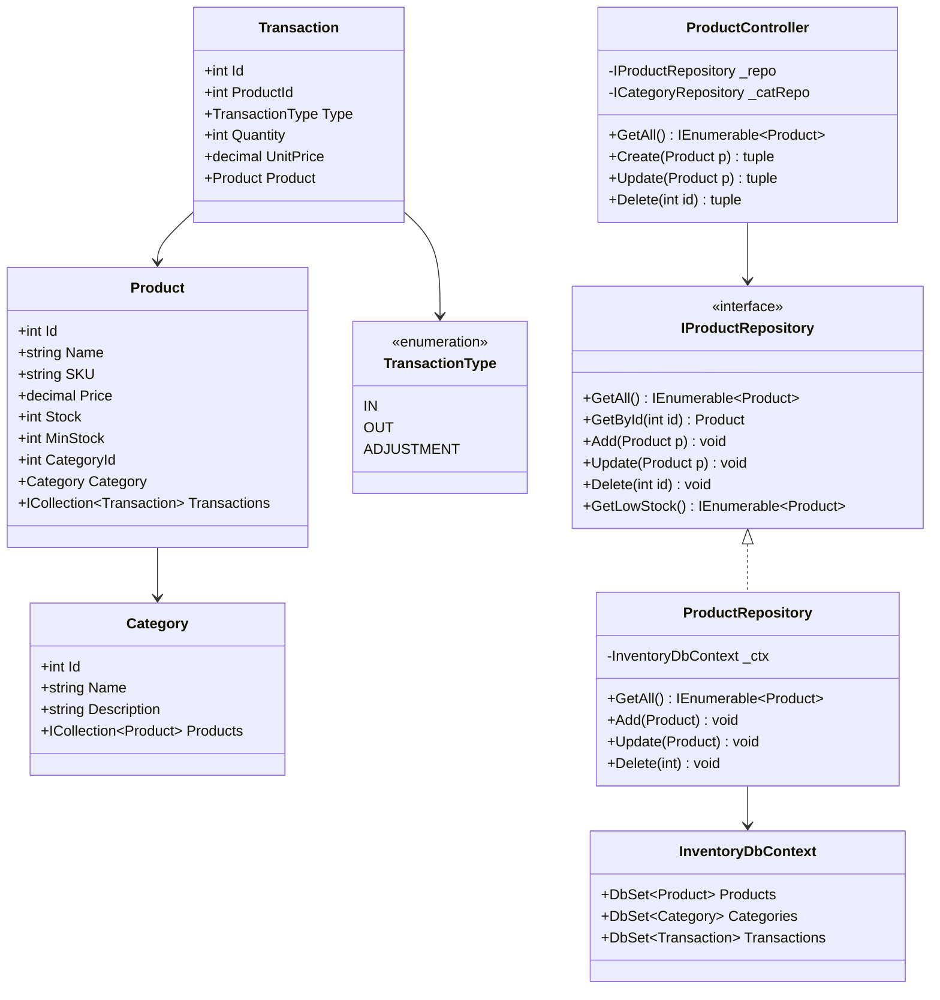
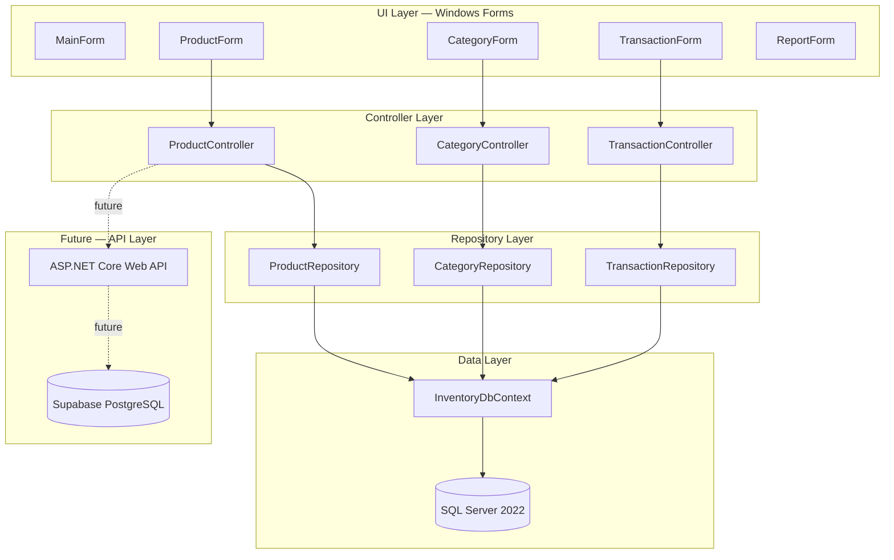
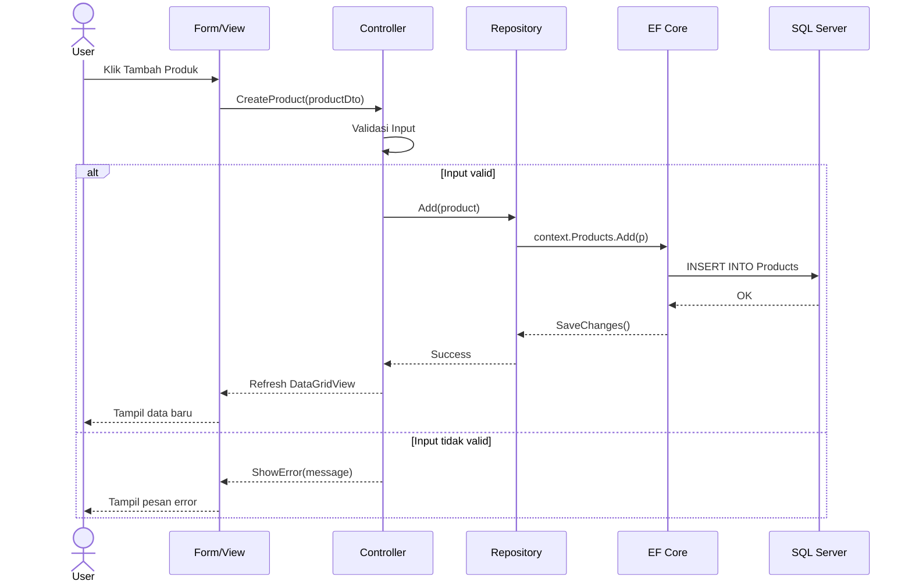
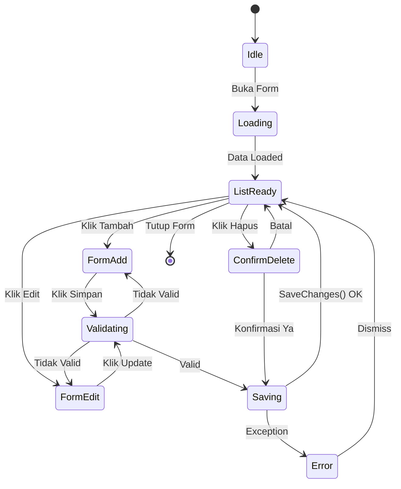

# Technical Design Document (TDD)
## Inventory Management System v1.0

---

| Field | Detail |
|---|---|
| **Dokumen** | Technical Design Document |
| **Versi** | 1.0.0 |
| **Status** | Released |
| **Tanggal** | April 2026 |
| **Platform** | Windows Desktop |
| **Teknologi** | C# · .NET 9 · Windows Forms · EF Core 9 · SQL Server 2022 |

---

## 1. Tujuan Dokumen

Dokumen ini menjelaskan keputusan desain teknis yang diambil dalam pembangunan
Inventory Management System v1.0. Dokumen ditujukan untuk developer yang akan
memelihara, mengembangkan, atau mempelajari kode aplikasi ini.

---

## 2. Gambaran Arsitektur

Aplikasi menggunakan pola arsitektur **MVC (Model-View-Controller)** yang dikombinasikan
dengan **Repository Pattern**. Pemisahan layer dilakukan secara eksplisit agar setiap
bagian memiliki satu tanggung jawab yang jelas.

```
┌─────────────────────────────────────────────────┐
│  PRESENTATION LAYER                             │
│  Windows Forms (Forms/)                         │
│  ProductForm, CategoryForm, TransactionForm     │
│  ReportForm, ProductDetailForm, dll             │
└────────────────────┬────────────────────────────┘
                     │ memanggil
┌────────────────────▼────────────────────────────┐
│  BUSINESS LOGIC LAYER                           │
│  Controllers (Controllers/)                     │
│  ProductController, CategoryController          │
│  TransactionController                          │
└────────────────────┬────────────────────────────┘
                     │ memanggil via Interface
┌────────────────────▼────────────────────────────┐
│  DATA ACCESS LAYER                              │
│  Repositories (Repositories/)                  │
│  ProductRepository, CategoryRepository          │
│  TransactionRepository                          │
└────────────────────┬────────────────────────────┘
                     │ menggunakan
┌────────────────────▼────────────────────────────┐
│  INFRASTRUCTURE LAYER                           │
│  InventoryDbContext (Data/)                     │
│  Entity Framework Core 9                        │
└────────────────────┬────────────────────────────┘
                     │ koneksi ke
┌────────────────────▼────────────────────────────┐
│  DATABASE                                       │
│  SQL Server 2022                                │
│  Database: InventoryDB                          │
└─────────────────────────────────────────────────┘
```


---

## 3. Keputusan Arsitektur

### 3.1 Mengapa MVC + Repository Pattern?

**Masalah yang diselesaikan:** tanpa pemisahan layer, Form langsung mengakses database.
Perubahan kecil di database bisa merusak tampilan, dan kode validasi tersebar di mana-mana.

**Keputusan:** memisahkan kode menjadi 4 layer dengan tanggung jawab masing-masing.

| Layer | Tanggung Jawab | Yang TIDAK boleh dilakukan |
|---|---|---|
| Forms (View) | Tampilkan data, tangkap input user | Tidak boleh akses DbContext langsung |
| Controllers | Validasi input, logika bisnis | Tidak boleh tahu detail UI (TextBox, dll) |
| Repositories | Eksekusi query database | Tidak boleh berisi logika bisnis |
| DbContext | Konfigurasi ORM dan koneksi | Tidak boleh dipanggil dari Form langsung |

**Manfaat ke depan:** karena Controller berkomunikasi lewat Interface bukan implementasi
langsung, mengganti Repository dari SQL Server ke API Supabase cukup dengan membuat
implementasi baru tanpa mengubah Controller atau Form sama sekali.

### 3.2 Mengapa Interface untuk Repository?

```csharp
// Controller bergantung pada Interface, bukan class konkret
private readonly IProductRepository _productRepo;

// Bukan ini:
// private readonly ProductRepository _productRepo;
```

Dengan Interface, dependency bisa diganti tanpa mengubah Controller. Ini menerapkan
prinsip **Dependency Inversion** dari SOLID. Di masa depan, `ProductRepository` yang
menggunakan EF Core bisa diganti dengan `ApiProductRepository` yang memanggil REST API
tanpa Controller perlu tahu perbedaannya.

### 3.3 Mengapa Tuple Return di Controller?

```csharp
public (bool Success, string Message) Create(Product product)
```

Keputusan ini memisahkan "apakah operasi berhasil" dari "apa pesannya". Form tidak perlu
try-catch sendiri, dan pesan error bisa ditampilkan dengan cara apapun (MessageBox,
Label, StatusBar) tanpa mengubah Controller.

### 3.4 Mengapa Satu DbContext untuk Seluruh Aplikasi?

DbContext dibuat sekali di `Program.cs` dan di-inject ke semua Repository. Keputusan ini
(disebut long-lived DbContext) tepat untuk aplikasi desktop single-user karena:

- Tidak ada overhead pembuatan koneksi berulang
- Perubahan di satu form langsung terlihat di form lain tanpa re-query
- Lebih sederhana untuk aplikasi dengan satu pengguna aktif

Konsekuensi yang harus dikelola: EF Core Change Tracker bisa menyimpan object lama
sehingga muncul conflict saat Update. Solusinya adalah `EntityState.Detached` sebelum
operasi Update dan Delete di Repository.


---

## 4. Struktur Project

```
InventoryApp/
├── Controllers/
│   ├── ProductController.cs       Validasi + CRUD produk
│   ├── CategoryController.cs      Validasi + CRUD kategori
│   └── TransactionController.cs   Validasi + pencatatan transaksi
│
├── Data/
│   └── InventoryDbContext.cs      DbContext, konfigurasi relasi, seed data
│
├── Forms/
│   ├── MainForm.cs/.Designer.cs        Jendela utama + navigasi menu
│   ├── ProductForm.cs/.Designer.cs     Daftar produk + toolbar CRUD
│   ├── ProductDetailForm.cs/.Designer  Dialog tambah/edit produk
│   ├── CategoryForm.cs/.Designer.cs    Daftar kategori + toolbar CRUD
│   ├── CategoryDetailForm.cs/.Designer Dialog tambah/edit kategori
│   ├── TransactionForm.cs/.Designer    Daftar transaksi + filter
│   ├── TransactionDetailForm.cs/.Des   Dialog tambah transaksi
│   └── ReportForm.cs/.Designer.cs      Laporan low stock + ringkasan
│
├── Migrations/
│   └── [timestamp]_InitialCreate.cs    Migration pertama (auto-generated)
│
├── Models/
│   ├── Category.cs      Domain model kategori
│   ├── Product.cs       Domain model produk
│   └── Transaction.cs   Domain model transaksi + enum TransactionType
│
├── Repositories/
│   ├── Interfaces/
│   │   ├── IProductRepository.cs
│   │   ├── ICategoryRepository.cs
│   │   └── ITransactionRepository.cs
│   ├── ProductRepository.cs
│   ├── CategoryRepository.cs
│   └── TransactionRepository.cs
│
├── appsettings.json     Connection string database
└── Program.cs           Entry point + Composition Root (perakitan DI)
```

---

## 5. Desain Database

### 5.1 Diagram Relasi

```
Categories          Products               Transactions
----------          --------               ------------
Id (PK)   ◄─────── CategoryId (FK)
Name                Id (PK)       ◄─────── ProductId (FK)
Description         Name                   Id (PK)
                    SKU (UNIQUE)            Type (1/2/3)
                    Description             Quantity
                    Price                   UnitPrice
                    Stock                   Notes
                    MinStock                TransactionDate
                    CreatedAt
                    UpdatedAt
```

### 5.2 Aturan Relasi

| Relasi | Tipe | On Delete |
|---|---|---|
| Category → Products | One-to-Many | RESTRICT (tolak hapus kalau masih ada produk) |
| Product → Transactions | One-to-Many | CASCADE (hapus produk = hapus semua transaksinya) |

### 5.3 Index

| Tabel | Kolom | Tipe Index |
|---|---|---|
| Products | SKU | UNIQUE INDEX |
| Categories | Name | UNIQUE INDEX |


---

## 6. Alur Data — Contoh: Tambah Produk Baru

```
User klik "Tambah" di ProductForm
        │
        ▼
ProductDetailForm ditampilkan (mode: Tambah, produk = null)
        │
User isi field Nama, SKU, Kategori, Harga, Stok
        │
User klik "Simpan"
        │
        ▼
ProductDetailForm.btnSimpan_Click()
    │   Validasi UI (ErrorProvider): nama kosong? SKU kosong? Kategori dipilih?
    │   Jika gagal → tampilkan ikon merah di field yang salah, STOP
    │
    ▼
ProductController.Create(product)
    │   Validasi bisnis: nama kosong? SKU duplikat? Harga negatif?
    │   Jika gagal → return (false, "pesan error"), STOP
    │
    ▼
ProductRepository.Add(product)
    │   Set CreatedAt = UpdatedAt = DateTime.Now
    │   _context.Products.Add(product)
    │   _context.SaveChanges()  ← eksekusi INSERT ke SQL Server
    │
    ▼
Controller return (true, "Produk berhasil ditambahkan")
        │
        ▼
ProductDetailForm: DialogResult = OK, Close()
        │
        ▼
ProductForm: ShowDialog() return OK → MuatData() → DataGridView refresh
```

---

## 7. Alur Data — Contoh: Tambah Transaksi OUT

```
User klik "Tambah Transaksi" di TransactionForm
        │
        ▼
TransactionDetailForm ditampilkan
        │
User pilih Produk, Tipe = OUT, Jumlah = 5
        │
User klik "Simpan"
        │
        ▼
TransactionDetailForm.btnSimpan_Click()
    │   Validasi UI: produk dipilih? Jumlah > 0?
    │
    ▼
TransactionController.Create(transaction)
    │   Jika tipe OUT: cek stok produk >= Quantity
    │   Jika stok tidak cukup → return (false, "Stok tidak mencukupi")
    │
    ▼
TransactionRepository.Add(transaction)
    │   Ambil Product dari database
    │   Hitung stok baru: Stock = Stock - Quantity
    │   Jika stok baru < 0 → throw exception (safety net kedua)
    │   _context.Transactions.Add(transaction)
    │   _context.SaveChanges()  ← simpan transaksi + update stok SEKALIGUS
    │
    ▼
TransactionForm: MuatData() → grid refresh dengan data terbaru
```

Catatan: update stok dan penyimpanan transaksi dilakukan dalam **satu SaveChanges()**.
Ini memastikan operasi bersifat atomik — keduanya berhasil atau keduanya gagal bersama.


---

## 8. Pola Desain yang Digunakan

### 8.1 Repository Pattern

Memisahkan logika akses data dari logika bisnis. Setiap entity memiliki interface
dan satu implementasi konkret.

```
Interface              Implementasi
IProductRepository  →  ProductRepository   (SQL Server via EF Core)
                    →  ApiProductRepository (future: REST API)
```

### 8.2 Dependency Injection Manual (Composition Root)

Seluruh perakitan dependensi dilakukan di `Program.cs`. Tidak ada class yang
membuat dependensinya sendiri — semua diterima lewat constructor.

```csharp
// Program.cs — Composition Root
var context         = new InventoryDbContext(options);
var productRepo     = new ProductRepository(context);
var categoryRepo    = new CategoryRepository(context);
var productCtrl     = new ProductController(productRepo, categoryRepo);
var mainForm        = new MainForm(productCtrl, categoryCtrl, transCtrl);
Application.Run(mainForm);
```

### 8.3 Partial Class (Windows Forms)

Setiap Form terdiri dari dua file:
- `FormNama.cs` — logika yang ditulis developer
- `FormNama.Designer.cs` — kode komponen UI yang di-generate Visual Studio

Keduanya digabung compiler menjadi satu class berkat keyword `partial`.

### 8.4 Anonymous Object untuk DataGridView

DataGridView tidak di-bind langsung ke `List<Product>` karena akan menampilkan
semua property termasuk navigation property yang tidak bisa ditampilkan sebagai teks.
Sebagai gantinya, dibuat anonymous object yang hanya berisi kolom yang diperlukan.

```csharp
var tampil = produk.Select(p => new {
    p.Id,
    p.SKU,
    Nama     = p.Name,
    Kategori = p.Category?.Name ?? "-",
    Harga    = p.Price,
    Stok     = p.Stock
}).ToList();
dgvProducts.DataSource = tampil;
```

---

## 9. Penanganan Error

### 9.1 Strategi Validasi Berlapis

| Layer | Jenis Validasi | Cara |
|---|---|---|
| Form | Validasi UI — field kosong, format | ErrorProvider (ikon merah di field) |
| Controller | Validasi bisnis — duplikat, aturan bisnis | Return (false, pesan) |
| Repository | Safety net — constraint database | Try-catch → return (false, pesan) |
| Database | Constraint FK, UNIQUE | Ditangkap Repository, disampaikan ke Form |

### 9.2 EF Core Change Tracker Conflict

Masalah: Update/Delete entity yang sudah di-track EF Core menyebabkan exception
"another instance with the same key is already being tracked".

Solusi yang diterapkan di semua Repository.Update() dan Repository.Delete():

```csharp
// Detach entity lama sebelum operasi
var tracked = _context.ChangeTracker.Entries<Product>()
    .FirstOrDefault(e => e.Entity.Id == product.Id);
if (tracked != null)
    tracked.State = EntityState.Detached;

// Baru lakukan Update/Delete
_context.Products.Update(product);
_context.SaveChanges();
```


---

## 10. Konfigurasi Aplikasi

### 10.1 appsettings.json

File konfigurasi dibaca saat startup menggunakan `Microsoft.Extensions.Configuration`.
Tidak ada nilai hardcode di dalam kode C# kecuali di `OnConfiguring` untuk kebutuhan
migration CLI.

```json
{
  "ConnectionStrings": {
    "DefaultConnection": "Server=localhost;Database=InventoryDB;
      Trusted_Connection=True;TrustServerCertificate=True;"
  }
}
```

File ini wajib ada di folder yang sama dengan `InventoryApp.exe` saat runtime.
Property `Copy to Output Directory` di-set ke `Copy if newer` agar ikut ter-copy
ke folder `bin/` saat build.

### 10.2 Database Migration

Migration dikelola oleh EF Core. Database dibuat dan diperbarui otomatis saat
aplikasi dijalankan melalui:

```csharp
context.Database.Migrate();
```

Perintah ini:
- Membuat database baru jika belum ada
- Menjalankan migration yang belum diaplikasikan
- Tidak melakukan apa-apa jika database sudah up-to-date

---

## 11. Deployment

### 11.1 Publish Settings

| Setting | Nilai |
|---|---|
| Configuration | Release |
| Deployment mode | Self-contained |
| Target runtime | win-x64 |
| Produce single file | True |
| Trim unused code | False (tidak aman untuk Windows Forms + EF Core) |

### 11.2 Isi Paket Distribusi

```
InventoryApp_v1.0_Client/
├── InventoryApp.exe                Aplikasi utama (self-contained)
├── appsettings.json                Konfigurasi connection string
├── Microsoft.Data.SqlClient.SNI.dll Driver jaringan SQL Server
├── install_database.sql            Script setup database
└── CARA_INSTALL.txt                Panduan instalasi untuk client
```

### 11.3 Syarat Komputer Client

| Komponen | Requirement |
|---|---|
| OS | Windows 10 / 11 (64-bit) |
| Database | SQL Server 2022 Express (gratis) |
| RAM | Minimal 4 GB |
| Disk | Minimal 500 MB |
| .NET Runtime | Tidak diperlukan (sudah termasuk dalam EXE) |

---

## 12. Panduan Pengembangan Lanjutan

### 12.1 Migrasi ke REST API (v3.0)

Karena Controller berkomunikasi lewat Interface, langkah migrasinya adalah:

1. Buat project baru `InventoryApp.Api` (ASP.NET Core Web API)
2. Pindahkan `Models/`, `Data/`, `Repositories/` ke shared library
3. Controller di API project memanggil Interface yang sama
4. Di Windows Forms, buat `ApiProductRepository` yang memanggil HTTP endpoint
5. Inject `ApiProductRepository` ke Controller di `Program.cs`
6. Controller dan Form tidak perlu diubah sama sekali

### 12.2 Menambah Entity Baru

Pola yang harus diikuti untuk menambah entity baru (misal: Supplier):

```
1. Buat Models/Supplier.cs
2. Tambah DbSet<Supplier> di InventoryDbContext
3. Buat Migrations: dotnet ef migrations add AddSupplier
4. Buat Repositories/Interfaces/ISupplierRepository.cs
5. Buat Repositories/SupplierRepository.cs
6. Buat Controllers/SupplierController.cs
7. Buat Forms/SupplierForm.cs dan SupplierDetailForm.cs
8. Daftarkan di Program.cs (Composition Root)
9. Tambah menu di MainForm
```

### 12.3 Menambah Role dan Autentikasi (v2.0)

```
1. Buat Models/User.cs dengan field: Username, PasswordHash, Role (enum)
2. Buat LoginForm.cs sebelum MainForm ditampilkan
3. Simpan CurrentUser di static class ApplicationState
4. Di setiap Controller, cek role sebelum izinkan operasi
5. Di setiap Form, sembunyikan/nonaktifkan tombol berdasarkan role
```

---

## 13. Riwayat Dokumen

| Versi | Tanggal | Perubahan |
|---|---|---|
| 1.0.0 | April 2026 | Dokumen awal — rilis v1.0 |

---

*Dokumen ini adalah referensi teknis untuk developer yang memelihara atau mengembangkan*
*Inventory Management System. Baca bersama PRD untuk pemahaman lengkap.*

---

## 13. Diagram Arsitektur dan Desain

Semua diagram menggunakan sintaks **Mermaid JS** dan dapat dirender di:
- VS Code dengan ekstensi "Markdown Preview Mermaid Support"
- GitHub (otomatis render di file .md)
- https://mermaid.live (paste dan lihat hasilnya)

### 13.1 ERD — Struktur Database



### 13.2 Class Diagram




### 13.3 Component Diagram



### 13.4 Sequence Diagram — Tambah Produk Baru



### 13.5 State Diagram — Siklus Status Form



